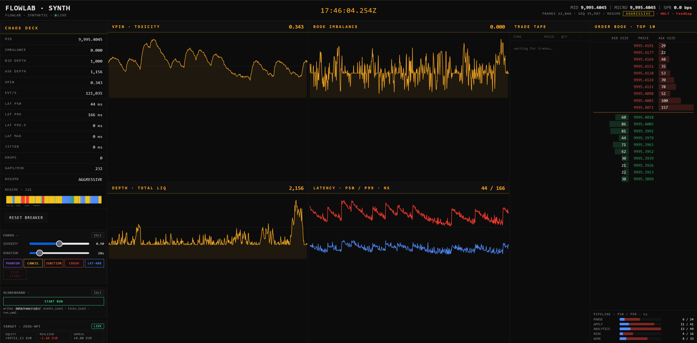

# ⚡ FLOWLAB

**Deterministic Multi-Language HFT Replay & Adversarial Microstructure Bench**

Rust core + Zig 0.13 ITCH parser + C++20 hot kernels + Go control plane &nbsp;|&nbsp;
185 tests (163 Rust + 12 Zig + 10 Go) &nbsp;|&nbsp; 40 B canonical Event ABI &nbsp;|&nbsp;
MoldUDP64 + WAL + SPSC mmap ring &nbsp;|&nbsp; Rust↔Zig↔C++ canonical L2 hash bit-identical &nbsp;|&nbsp;
6-guard fail-closed risk gate &nbsp;|&nbsp;
React/uPlot **CHAOS desk** with 5 live storm injectors and a 3-file run
recorder (`run.yaml` + `events.jsonl` + `ticks.jsonl`) — see
[`dashboard/`](dashboard/), [`api/`](api/) and [`engine/`](engine/).


<sub>Single-origin desk: Rust engine on `:9090` → Go bridge on `:8080` → React/uPlot dashboard. Left rail = CHAOS DECK + SCOREBOARD + TARGET (ZEUS-HFT). Bottom-right = pipeline stage latency (parse / apply / analytics / risk / wire) p50 + p99.</sub>

> [!IMPORTANT]
> 📄 **Latency documents:**
> - 📈 [`docs/latency-alpha.md`](docs/latency-alpha.md) — α optimisation log: **intrinsic share flip 25 % → 73 %** (cache-bound → compute-bound), rejected alternatives kept with diagnosis
> - 🔁 [`docs/latency-cross-hw.md`](docs/latency-cross-hw.md) — `HotOrderBook<256>` **TOTAL p50 = 22 ns** reproduced **5/5 across two CPU generations** (AMD Ryzen + Intel i7), zero variance on p50
>
> 📐 **Design documents:**
> - 🎯 [`docs/feed-design.md`](docs/feed-design.md) — why **ITCH replay alone is not enough for chaos**, why the synthetic feed lives in Go, storm parameter discipline, rejected alternatives
> - 🧱 [`docs/stack-rationale.md`](docs/stack-rationale.md) — **why 4 + 1 languages**, what each layer is forbidden from doing, FFI contract, cost of the multi-language stack (honest)

### TL;DR

| Signal | Value |
| --- | --- |
| `HotOrderBook::apply` TOTAL p50 (5/5 cross-CPU) | **22 ns** |
| Cross-impl L2 hash agreement (Rust ↔ Zig ↔ C++) | `0xf54ce1b763823e87` |
| Snapshot resume | replay-from-checkpoint **≡** replay-from-scratch (e2e proven) |
| Tests | **185** (163 Rust + 12 Zig + 10 Go) |
| Canonical `Event` ABI | **40 B**, frozen, `#[repr(C)]` |
| Risk gate guards | **6**, fail-closed, latching |
| Live storm injectors | **5** (Phantom · Cancel · Ignition · Crash · Lat-Arb) |

Multi-language pipeline for market-data replay, microstructure analytics,
HFT aggression detection, and **adversarial bot stress-testing** under
controlled storm conditions. Same input bytes produce identical state,
byte-for-byte, across runs and platforms.

> [!WARNING]
> **Research and simulation framework. Not a trading system.**
>
> **Modeled:** deterministic order flow replay, microstructure analytics,
> chaos pattern detection, live adversarial storms against a third-party
> trading bot (TARGET), audit-grade run recording.
>
> **Not modeled:** market impact, queue position, fill probability,
> exchange matching, latency arbitrage outcomes, real PnL.

---

## 🧭 Positioning

**flowlab is the deterministic data + analytics substrate an HFT
research stack sits on top of — it is not the full trading stack.**

Four languages, one source of truth: Rust owns the state machine, Zig
owns the parser, C++ owns the hot kernels, Go owns I/O. The
cross-implementation invariants — canonical L2 hash bit-identical,
40 B Event ABI, replay-stable analytics, deterministic WAL halt on
gaps — are validated in CI, not assumed.

The scope is a deliberate choice. A serious strategy stack needs a
reproducible substrate **before** matching engine, fill model and
queue tracking. Those layers are intentionally out of perimeter: they
depend on venue-specific assumptions (NASDAQ ITCH vs CME MDP3 vs CBOE
PITCH) and on proprietary information (queue position, fill
probability, market impact) that must not contaminate the base.
flowlab provides the primitives a coherent matching layer can be
built on; it does not pretend to be that layer.

---

## 📐 Core principles

- **Determinism first.** Sequence-driven execution. Wall-clock time is
  informational; it is never an input to ordering.
- **Event sourcing.** All state derives from an immutable, append-only
  event log. Snapshots are cached projections, never sources of truth.
- **Separation of I/O and computation.** Go handles the world; Rust
  owns the truth; C++ owns speed; Zig owns specialization.
- **Zero-copy across the boundary.** No serialization between ingest
  and core. Mmap ring → Zig parser → Rust normalizer.
- **Performance discipline.** Pre-allocated buffers, `#[repr(C)]`
  layouts, no hidden allocation in the hot path. Correctness is
  proved by cross-impl hash agreement *before* any micro-opt lands.

---

## 🗂️ Language responsibilities

The project is **Rust-core**: ~80% of the code (and the entire
deterministic state machine, replay, WAL, risk gate, analytics) is
Rust. The other languages are scoped specializations.

| Concern        | Language | Scope                                              | LOC     |
| -------------- | -------- | -------------------------------------------------- | ------- |
| Truth          | Rust     | Event ABI, state machine, replay, WAL, analytics   | ~16,200 |
| Specialization | Zig 0.13 | `comptime` ITCH 5.0 parser, zero-copy              | ~490    |
| Speed (opt-in) | C++20    | L2 book + Welford stats behind `--features native` | ~530    |
| I/O + control  | Go       | mmap ring writer, WS ingest, control plane + CHAOS | ~2,800  |
| UI             | TS/TSX   | React + Vite + uPlot CHAOS desk (`dashboard/`)     | ~1,200  |

C++ count is hand-written code only; the vendored single-header
`hotpath/include/xxhash.h` (~6.6 kLOC, XXH3 reference impl v0.8.3)
is excluded.

Go **never** participates in replay. C++ and Zig never touch the
network. The deterministic core has no runtime dependency on either
GC or syscalls beyond `read` / `mmap`.

---

## 🏗️ Architecture

```
┌──────────────────────────────────────────────────────────────────┐
│                        NON-DETERMINISTIC                          │
│  Go ingest  ── WS / HTTP / file ── reconnect ── backpressure     │
└──────────────────┬───────────────────────────────────────────────┘
                   │  mmap ring (SPSC, lock-free, atomic indices)
                   ▼
┌──────────────────────────────────────────────────────────────────┐
│                         DETERMINISTIC CORE                        │
│                                                                   │
│  Zig feed-parser  ── ITCH 5.0 / FIX / OUCH ── zero-copy          │
│        │                                                          │
│        │  extern "C"  (40 B Event, #[repr(C)], align 8)          │
│        ▼                                                          │
│  Rust normalizer ── canonical event log ── WAL ── snapshots      │
│        │                                                          │
│        ├── replay engine (flowlab-replay)                         │
│        ├── microstructure analytics + risk gate (flowlab-flow)   │
│        ├── HFT aggression detection (flowlab-chaos)               │
│        └── state verifier (flowlab-verify)                        │
│                                                                   │
│  C++ hot path (hotpath/)  ←  FFI  ──  book, hasher, stats        │
└──────────────────────────────────────────────────────────────────┘
```

---

## 🧱 Canonical event (frozen ABI)

```
offset  size  field
 0       8    ts              u64 LE, nanoseconds (informational)
 8       8    price           u64 LE, integer ticks
16       8    qty             u64 LE
24       8    order_id        u64 LE
32       4    instrument_id   u32 LE
36       1    event_type      u8
37       1    side            u8
38       2    _pad            [u8; 2]
                              ────────
                              40 B, align(8), #[repr(C)]
```

Properties:

- Little-endian on all supported targets.
- `bytemuck::Pod + Zeroable` on the Rust side; POD on the C++ side.
- Bit-identical across Rust / C++ / Zig; no padding ambiguity.
- Any change bumps the canonical L2 hash in `flowlab-verify`.

---

## 📡 Live runtime + dashboard

The deterministic core can be driven by a runtime binary that exposes a
versioned telemetry stream over TCP. A Go bridge consumes that stream
and re-broadcasts it as JSON over WebSocket to a React/uPlot dashboard.

```
flowlab-engine (Rust, :9090)
    ├── Source         : synthetic | itch
    ├── Pipeline       : HotOrderBook + VPIN + spread + imbalance
    ├── Risk gate      : CircuitBreaker (probed for latency)
    ├── Backpressure   : bounded mpsc(8192), drop counter exposed
    └── Wire           : [u32 len][u16 ver=1][bincode|json payload]
                                │
                                │ TCP
                                ▼
                      api/ (Go, :8080)
                     EngineClient + WS /stream
                                │
                                ▼
                  dashboard/ (React + Vite + uPlot)
                  6 streaming panels + ±2σ bands + KPI sidebar
```

Frame schema lives in [`engine/src/wire.rs`](engine/src/wire.rs)
(`TelemetryFrame::{Header, Tick, Book, Risk, Lat, Heartbeat}`). Every
`Tick` carries **two clocks** kept deliberately separate:

- `event_time_ns`   \u2014 source-provided wall clock (ITCH ts48, Binance E)
- `process_time_ns` \u2014 engine `CLOCK_MONOTONIC` at apply
- `latency_ns = process - event` is computed only where the two clocks
  are comparable (replay yes, crypto WAN no).

### Run the desk locally

```bash
# 1. start the Rust runtime
cargo run -p flowlab-engine --release -- \
  --source synthetic --wire json --listen 127.0.0.1:9090 --tick-hz 50

# 2. start the Go bridge
cd api && go run ./cmd/api -addr :8080 -feed engine -engine 127.0.0.1:9090

# 3. start the dashboard
cd ../dashboard && npm install && npm run dev   # http://localhost:5173
```

`-feed=synthetic` keeps the legacy in-process Go feed for offline
dashboard hacking. The dashboard contract is unchanged across modes.

### Run modes (production vs UI dev)

The dashboard ships in **two modes**, and they are not the same thing.
For demos and stress runs use single-origin; for UI work use Vite dev.

| Mode                | Command                                    | Origins                                  | When to use                                       |
| ------------------- | ------------------------------------------ | ---------------------------------------- | ------------------------------------------------- |
| **Single-origin**   | `.\run-desk.ps1`                           | `:8080` only — Go serves `dashboard/dist/` + WS + control plane | Default. Demos, recorded runs, day-to-day driving the desk. No CORS, no WS proxy fragility, Firefox does not throttle. |
| **UI dev (HMR)**    | `.\run-desk.ps1 -Dev` (or `npm run dev`)   | `:5173` (Vite UI) → proxies `/stream` `/storm` `/run` `/bot` `/health` `/status` `/reset` to `:8080` | Only when modifying React components. Hot-module-reload, source maps, React DevTools. |

The Go process always owns `:8080` (WS + REST + recorder). Vite never
talks to the Rust engine directly. In production there is no Node
runtime at all — the React bundle is just static files served by Go.


---

## 🌪️ Adversarial desk

The dashboard is also a **stress-testing console** against a real
external trading bot (the *target*). Five chaos kinds can be fired
into the synthetic feed live, with full auditability: every run
produces a deterministic 3-file artefact set on disk.

```
                      ┌─────────────────────────────────┐
                      │   CHAOS DECK (left aside)       │
                      │  PHANTOM · CANCEL · IGNITION    │
                      │  CRASH   · LAT-ARB              │
                      │                                 │
                      │  severity ∈ [0,1]               │
                      │  duration ∈ [5s, 120s]          │
                      └────────────┬────────────────────┘
                                   │ POST /storm/start
                                   ▼
        ┌─────────────────────────────────────────────────┐
        │  StormController (api/server/storm.go)          │
        │  + per-kind injectors in feed.go                │
        │    • PhantomLiquidity → ±40% depth oscillation  │
        │    • CancellationStorm → 4× EPS, VPIN ↑, vel ↓  │
        │    • MomentumIgnition → directional drift on imb│
        │    • FlashCrash → mid slide + spread blowout    │
        │    • LatencyArbProxy → p99 tail explosion       │
        └────────────┬────────────────────────────────────┘
                     │ corrupted Ticks broadcast on /stream
                     ▼
        ┌─────────────────────────────────────────────────┐
        │  TARGET (external HFT bot, e.g. ZEUS-HFT)       │
        │  reads its own venue feed (cTrader demo)        │
        │  exposes /api/state with equity / pnl / signals │
        └────────────┬────────────────────────────────────┘
                     │ polled by Recorder + BotPanel
                     ▼
        ┌─────────────────────────────────────────────────┐
        │  Recorder (api/server/recorder.go)              │
        │    data/runs/<UTC-id>/                          │
        │      ├─ run.yaml      desk-grade summary        │
        │      ├─ events.jsonl  storm + signal events     │
        │      └─ ticks.jsonl   1Hz sampled microstructure│
        └─────────────────────────────────────────────────┘
```

### Storm kinds

| Button     | Kind                | Effect on the synthetic tick                        |
| ---------- | ------------------- | --------------------------------------------------- |
| `PHANTOM`  | `PhantomLiquidity`  | Depth oscillates ±40% at ~1Hz (visible book churn)  |
| `CANCEL`   | `CancellationStorm` | EPS up to 4×, VPIN climbs, trade velocity collapses |
| `IGNITION` | `MomentumIgnition`  | Directional mid drift (sign = current imbalance)    |
| `CRASH`    | `FlashCrash`        | Linear mid slide + spread blowout                   |
| `LAT-ARB`  | `LatencyArbProxy`   | P99 tail latency explodes; P50 stays cold           |

Severity (0..1) and duration (5s..120s) are operator-controlled. The
storm ends deterministically; the breaker latches if regime escalates
to `Crisis` and gaps accumulate.

### Run artefacts

`run.yaml` is the desk's scoreboard. Self-contained, hand-rolled YAML
(no dep), with verdict computed from `target.delta`:

```yaml
run_id: 2026-04-22T17-50-18Z
started_at: 2026-04-22T17:50:18Z
ended_at:   2026-04-22T17:50:31Z
duration_s: 13
tick_samples: 14
storms_fired:
  - kind: FlashCrash
    started_at_ms: 1776876627753
    severity: 0.850
    duration_ms: 3000
    target_pnl_delta_eur: -2.40
target:
  bot: zeus-hft
  currency: EUR
  start_equity: 99712.73
  end_equity:   99710.33
  delta:        -2.40
  total_trades: 4
  wins: 1
  losses: 3
  win_rate: 0.250
verdict: TARGET_DAMAGED    # TARGET_INTACT | TARGET_DAMAGED (<-10) | TARGET_KILLED (<-100)
```

> The example above is illustrative — `delta: -2.40` would actually
> classify as `TARGET_INTACT`. Verdict thresholds (`-10`, `-100`) are
> calibrated against the bot's own equity scale; recorded runs on
> [`data/runs/`](data/runs/) include all three outcomes.

`events.jsonl` is the audit trail (`run_start`, `storm_start`,
`storm_stop`, `target_signal`, `run_stop`). `ticks.jsonl` is a 1 Hz
sample of the full microstructure tick (mid, depth, VPIN, latency,
regime, storm_active, storm_kind) for offline analysis.

### Control plane endpoints

| Method | Path              | Purpose                                     |
| ------ | ----------------- | ------------------------------------------- |
| `POST` | `/storm/start`    | Fire one of 5 storm kinds                   |
| `POST` | `/storm/stop`     | Cancel active storm                         |
| `GET`  | `/storm/status`   | `{mode, kind?, severity, expires_at_ms?}`   |
| `POST` | `/run/start`      | Open a new recorded run directory           |
| `POST` | `/run/stop`       | Finalize `run.yaml`, close JSONL files      |
| `GET`  | `/run/status`     | Currently active run (if any)               |
| `GET`  | `/run/list`       | All runs on disk                            |
| `GET`  | `/run/{id}/yaml`  | Stream a finished `run.yaml`                |
| `GET`  | `/bot/state`      | Reverse-proxy to TARGET's `/api/state`      |
| `GET`  | `/bot/health`     | Reverse-proxy to TARGET's `/api/health`     |

The dashboard's CHAOS DECK + SCOREBOARD + TARGET panels are thin
clients over these endpoints. Every storm fired and every tick
sampled during an active run lands on disk before the WebSocket frame
leaves the bridge.

### Connecting a bot (TARGET adapter)

The bench is **bot-agnostic**. Any external trading bot becomes the
`TARGET` by exposing two HTTP endpoints on `127.0.0.1:3001` (default
— configurable via `botHealthURL` in [api/server/server.go](api/server/server.go)):

| Method | Path           | Required response                                                              |
| ------ | -------------- | ------------------------------------------------------------------------------ |
| `GET`  | `/api/health`  | `200 OK` with any body. Used for liveness only.                                |
| `GET`  | `/api/state`   | JSON object with at least: `equity` (number, base currency), `currency` (3-letter ISO), `total_trades`, `wins`, `losses`. Optional: `realized_pnl`, `unrealized_pnl`, `signals` (array). |

Minimal `/api/state` body the recorder understands:

```json
{
  "bot": "my-hft-bot",
  "currency": "EUR",
  "equity": 99710.33,
  "realized_pnl": -1.60,
  "unrealized_pnl": 0.00,
  "total_trades": 4,
  "wins": 1,
  "losses": 3
}
```

The connection model is **pull, not push**:

1. The bot keeps its own venue connection (e.g. ZEUS-HFT \u2192 cTrader
   FIX on demo). flowlab does **not** route orders or feed data into
   the bot.
2. flowlab polls `/api/state` every \u22481 s for the BotPanel and twice
   per recorded run (start + stop) for `run.yaml`'s `target.delta`.
3. The CHAOS storms reshape the **synthetic feed on `/stream`**, not
   the bot's venue feed. The bot is stressed indirectly: if it
   subscribes to flowlab's `/stream`, it sees corrupted ticks; if it
   trades on its own venue, the bench measures whether the bot's
   internal regime detection / risk gate noticed the external storm.

This pull model is intentional: it lets flowlab benchmark **any**
bot \u2014 Python, C++, Go, closed-source binaries \u2014 as long as it can
expose two GET endpoints. Polling is best-effort and non-blocking; if
the bot is down, the recorder still produces a valid `run.yaml` with
zeroed target fields and a `bot_unreachable` event in `events.jsonl`.

---

## 🔗 Inter-language data path

No serialization layer exists between ingest and core.

```
Go (ingest)  ──[ mmap ring, SPSC, atomic indices ]──►  Zig (parser)
                                                          │
                         extern "C"  (40 B Event)         │
                                                          ▼
                                                   Rust (normalizer)
```

### Ring-buffer layout

```
0        "FLOWRING"        magic (8 B)
8        capacity          u64 LE (power of two)
64       writeIdx          u64 atomic
128      readIdx           u64 atomic
192      payload           capacity bytes
```

Single producer / single consumer. Release-store on `writeIdx` after
payload; acquire-load on the reader. Producer blocks on full; reader
never observes a partial batch.

### Transport (production)

- **MoldUDP64** (`session[10] | seq BE | count BE | [u16 BE len | msg]×count`)
- UDP multicast ingress with `GapTracker` and bounded forward buffer.
- `count = 0` → heartbeat; `count = 0xFFFF` → end-of-session.

---

## 💾 Durability & recovery

| Component                     | Guarantee                                                |
| ----------------------------- | -------------------------------------------------------- |
| WAL (`replay::wal`)           | 64 MiB segments, `len | CRC32 | payload`, torn-tail safe |
| Event log                     | Append-only, length-prefixed, CRC'd                      |
| Snapshots                     | Content-addressed; replay resumes from nearest seq       |
| Ring IPC                      | Backpressure, never silent drop                          |
| MoldUDP64 gap handling        | Bounded forward buffer; deterministic gap halt           |

Bit-exact replay is a test invariant: the WAL reproduces the canonical
L2 hash `0xf54ce1b763823e87` over 5000 events.

---

## 🛡️ Risk gate

[flow/src/circuit_breaker.rs](flow/src/circuit_breaker.rs) is the last
line of defence before any outbound order. Every submission path MUST
call `CircuitBreaker::check(&Intent)` and respect the `Decision`.

| Guard             | Trip condition                                          |
| ----------------- | ------------------------------------------------------- |
| Rate limit        | Token bucket (orders / sec)                             |
| Position cap      | `abs(net_pos + order_qty) > max_position`               |
| Daily-loss floor  | `cash_flow_ticks < -max_daily_loss_ticks`               |
| OTR ceiling       | `orders / max(1, trades) > max_otr` (post-warmup)       |
| Feed gap          | `gaps_within(window) >= gap_threshold`                  |
| Manual kill       | Operator latch                                          |

Tripping latches. Recovery is explicit (`reset`, `start_of_day`).
Fail-closed, always.

---

## 🔁 Determinism model

### Sequencing

- Monotonic global sequence ID per event log.
- Compound key `(channel_id, seq)` for multi-feed scenarios.
- Timestamps are informational only; ordering never depends on them.
- Sequence gaps halt the engine deterministically — no silent skip.

### Clock model

The engine carries **two clocks** and never conflates them.

| Clock              | Source                                  | Used for                          |
| ------------------ | --------------------------------------- | --------------------------------- |
| `event_time_ns`    | feed payload (ITCH ts48, Binance `E`)   | display, microstructure analytics |
| `process_time_ns`  | engine `CLOCK_MONOTONIC` at `apply()`   | latency probes, replay diagnostics |

Neither clock affects ordering. Replay is driven by sequence ID alone,
so `process_time_ns` is reproducible across runs only in pure replay
mode; in live ingest it diverges by design. `latency_ns = process -
event` is reported only where the two clocks are actually comparable
(replay yes, crypto WAN no).

### Backpressure semantics

Every boundary that crosses runtime domains has an explicit
back-pressure rule. Silent drop is forbidden.

| Boundary                          | Rule                                              |
| --------------------------------- | ------------------------------------------------- |
| Go ingest → Rust core (mmap ring) | SPSC, producer **blocks** on full; reader never sees partial batch |
| MoldUDP64 ingress (forward buf)   | Bounded; overflow → deterministic gap halt        |
| Engine → telemetry bridge (mpsc)  | Bounded `mpsc(8192)`; drop counter exposed in `TelemetryFrame::Risk` |
| Bridge → WebSocket clients        | Per-client buffer; slow client is dropped, not the engine |

The deterministic core is never starved by a slow consumer and never
silently loses data; failures surface as halts or counters.

### Cross-language verification

Every stage emits an `xxh3_64` digest with domain tag `FLOWLAB-L2-v1`.

```
Rust digest  ══╗
Zig digest   ══╣  MUST BE IDENTICAL  (validated, CI-gated)
C++ digest   ══╝
```

- **Rust ↔ Zig:** validated. The Zig parser asserts at `comptime`
  that `@sizeOf(Event) == 40` and exports `flowlab_event_size()`,
  which Rust checks on every `parse_itch` call. Same input bytes
  produce the same canonical events.
- **Rust ↔ C++:** validated. The canonical L2 hash uses
  `XXH3_64bits` on both sides (single-header
  [`xxhash.h`](hotpath/include/xxhash.h) v0.8.3 in C++,
  `xxhash-rust` in Rust) with the same scheme: domain seed
  `XXH3_64bits("FLOWLAB-L2-v1", 13)`, 16 B per level
  `(price_le, total_qty_le)`, `'|'` side separator, XOR-fold per level.
  Cross-FFI bench in [`bench/benches/pipeline.rs`](bench/benches/pipeline.rs)
  asserts byte-for-byte digest equality over 50 000 events:
  Rust `HotOrderBook` and C++ `OrderBook` both produce
  `0xf54ce1b763823e87`.

Any digest mismatch within a verified pair is a hard failure: replay
aborts.

### Failure modes

| Failure                          | Behaviour                                   |
| -------------------------------- | ------------------------------------------- |
| Corrupted event (bad magic / CRC)| Rejected at normalization, never logged     |
| Sequence gap                     | Deterministic halt + gap report             |
| Parser error                     | `-1` return; caller handles; no partial log |
| Cross-language hash mismatch     | Replay aborted; state diff emitted          |
| Ring full                        | Producer blocks (backpressure, no drop)     |

No partial state mutation is ever allowed. Atomic all-or-nothing.

---

## ⚡ Performance discipline

Rules enforced in code review and CI.

1. **Pre-allocate everything in the hot path.** `HashMap::with_capacity`,
   `Vec::with_capacity` for book levels, order lookup, event buffers,
   replay buffers. Zero reallocations during steady state.
2. **`#[repr(C)]` for every struct crossing the FFI.** `repr(align(n))`
   where required. Layout is part of the ABI; changing it bumps the
   canonical hash.
3. **No unaligned raw-pointer access.** Parser readers use
   `read_unaligned` only where the wire format demands it, and never
   for shared-memory structs.
4. **Swap hashers only with numbers.** The stdlib hasher is DoS-safe
   and the default. A faster hasher ships only with a bench proving
   the win on our workload.
5. **Correctness before speed, always.** A change that breaks the
   canonical L2 hash does not land, period.

These rules are aligned with the FFI and ABI contracts above: stable
layout plus pre-allocated capacity is what eliminates both layout
mismatches and memory churn.

---

## 🗺️ Project layout

```
flowlab/
├── core/                Rust: event, state machine, FFI to C++
├── replay/              Rust: engine, WAL, ring, ITCH, MoldUDP64, UDP
├── flow/                Rust: microstructure analytics + risk gate
├── chaos/               Rust (+C++): HFT aggression detection
├── verify/              Rust: cross-language state hashing
├── engine/              Rust: live runtime + TCP telemetry wire (:9090)
├── hotpath/             C++20: book, matching sim, rolling stats
├── feed-parser/         Zig 0.13: comptime ITCH parsers, zero-copy
├── ingest/              Go: WS / HTTP / file ingest, mmap ring producer
├── api/                 Go: control plane, CHAOS injector, recorder (:8080)
├── dashboard/           React + Vite + uPlot: CHAOS desk UI
├── bench/               Rust: criterion benchmarks
├── bin/                 Built Go binaries (api server)
├── data/                Binary event logs + run artefacts (data/runs/)
├── docs/                latency-alpha.md (α optimisation log) +
│                        latency-cross-hw.md (cross-CPU reproduction)
├── run-desk.ps1         One-shot orchestrator (engine + api + dashboard)
├── .github/workflows/   CI matrix (Linux + Windows, ±native)
├── Cargo.toml           Rust workspace
├── go.work              Go workspace
├── Makefile             Unified build orchestration
└── README.md
```

Every top-level folder has its own `README.md` with the detailed
contract.

---

## 🔨 Build

```bash
# full build (portable Rust + Zig + C++ + Go)
make all

# Rust workspace, portable only
cargo build --release

# Rust + native FFI (C++ hot path + Zig static lib)
cargo build -p flowlab-core --features native

# Zig feed parser
cd feed-parser && zig build -Doptimize=ReleaseFast

# Go services
cd ingest && go build ./...
cd api    && go build ./...
```

Prerequisites for `--features native`:

- Rust ≥ 1.83 (edition 2024)
- Zig 0.13.0 on PATH
- A C++20 toolchain: MSVC 2022 Build Tools on Windows, clang++ ≥ 16
  or g++ ≥ 12 elsewhere

---

## 🧪 Test

```bash
cargo test --workspace                              # pure Rust
cargo test --workspace --features native            # + FFI
cd feed-parser && zig build test --summary all      # Zig unit tests
cd ingest      && go test -race -count=1 ./...      # Go
```

Passing counts (verified by `cargo test --workspace --features native`
+ `zig build test` + `go test ./...`): **185 total** = 163 Rust + 12 Zig
+ 10 Go. Breakdown:

| Surface                                                            | Tests       |
| ------------------------------------------------------------------ | ----------- |
| `flowlab-chaos` (5 storm injectors + legacy + clustering)          | 71          |
| `flowlab-replay` (unit + `ring_ipc`)                               | 38 + 2      |
| `flowlab-e2e` (chaos drift / e2e / fuzz / `cpp_hasher_agreement` / `snapshot_resume`) | 22 |
| `flowlab-core` (`hot_book` + snapshot + event + state)             | 15          |
| `flowlab-flow` (circuit breaker, analytics, regime)                | 8           |
| `flowlab-bench` (cross-impl hash gate + latency bins)              | 5           |
| `flowlab-engine` (lib + `ich_real`)                                | 1           |
| Doctest                                                            | 1           |
| Zig `feed-parser` (`itch.zig` + `main.zig`)                        | 12          |
| Go `ingest/` (mmap ring + WS feed)                                 | 6           |
| Go `api/` (regime parity vs Rust)                                  | 4           |

### Test layout

FLOWLAB follows the conventional **three-tier test pyramid** of every
language in the stack. Tests live next to what they prove, by design:

| Tier            | Where                                                | What it proves                                  |
| --------------- | ---------------------------------------------------- | ----------------------------------------------- |
| **Unit**        | `#[cfg(test)] mod tests` at the bottom of each Rust module (`chaos/src/*.rs`, `flow/src/*.rs`, `core/src/*.rs`, …); `*_test.go` next to each Go file; `test "..."` blocks in each `.zig` source | Module-internal invariants. Access to `pub(crate)` and unexported items — **must** stay co-located. |
| **Integration** | `<crate>/tests/*.rs` (e.g. [engine/tests/ich_real.rs](engine/tests/ich_real.rs), [replay/tests/ring_ipc.rs](replay/tests/ring_ipc.rs)) | The crate's **public** API contract. Compiled as a separate binary; can only see `pub` items. |
| **System**      | [tests/](tests/) (`flowlab-e2e` crate — e2e/, fuzz/, chaos/) | Cross-crate invariants: bit-exact replay, hash agreement, ring SPSC ordering, parser robustness, 10 M-event drift. The *signal layer*. |

`cargo test --workspace` collects every Rust tier in one command; tier
separation is structural, not procedural. Putting unit tests anywhere
but next to the module they cover would force `pub(crate)` items to
leak into the public API — the layout above is the language
convention, not loose organization.

---

## 📈 Benchmarks

```bash
cargo bench -p flowlab-bench                        # pipeline, replay
cargo bench -p flowlab-bench --features native      # with C++ + Zig
```

All benches use pre-allocated buffers and seeded synthetic streams.
No I/O inside measured regions.

### Hot-path latency (`HotOrderBook::apply`, single-instrument)

Median over 5 consecutive runs, two CPU generations (AMD Ryzen +
Intel i7), Windows, no kernel tuning, no isolcpus, no HUGE pages.
`TOTAL p50 = 22 ns` was recorded on **5/5 runs on both boxes** — the
number is a property of the code, not of the host.

| Metric (STEADY mix + prefetch, 500k events) | Median  | Best    |
| ------------------------------------------- | ------- | ------- |
| TOTAL p50                                   | 22 ns   | 22 ns   |
| TOTAL p99                                   | 88 ns   | 80 ns   |
| TRADE p50                                   | 28-30 ns| 28 ns   |
| TRADE p99                                   | 128-144 | 96 ns   |
| Wall apply-only (500 000 events)            | 17.4 ms | 16.6 ms |

The α optimisation log moved the workload from cache-bound to
compute-bound: TRADE intrinsic share of the mix p99 went from 25 % to
73 %. Two changes (`trade()` hot/cold split + `prefetch_event` on
slab + level grid), zero new `unsafe`, full backwards-compatible
semantics. A third change (lane-batched `apply_lanes`) was tried,
proved correct via canonical L2 hash equivalence, and **rejected**
(+8.8 % wall vs interleaved) — diagnosis kept in the doc.

- Methodology, per-phase histograms, attribution and rejected
  alternatives → [`docs/latency-alpha.md`](docs/latency-alpha.md)
- Cross-hardware reproduction (5/5 runs, two CPUs, zero variance on
  p50) → [`docs/latency-cross-hw.md`](docs/latency-cross-hw.md)

### Reference numbers — parsing + full pipeline (best observed stable run)

| Bench                | Time           | Throughput        |
| -------------------- | -------------- | ----------------- |
| `itch_parse/10000`   | ~120-130 µs    | ~2.3-2.6 GiB/s    |
| `itch_parse/100000`  | ~1.22-1.35 ms  | ~2.3 GiB/s        |
| `full_hot/10000`     | —              | ~600-650 MiB/s    |

**Methodology** (required for any number above to be replicable):

- Reported as **best observed stable run under idle system**, not the
  mean across noisy runs. Multi-run variance is reported separately
  for diagnostics.
- Hardware: consumer x86-64 laptop, hybrid P/E-core CPU, AVX2.
- Power scheme: Windows **Balanced**, processor boost mode
  **AGGRESSIVE** (`PERFBOOSTMODE = 2`). No CPU pinning, no priority
  boost (the OS scheduler outperformed manual pinning on this rig).
- Thermal: passive idle, no sustained load before measurement.
- Harness: Criterion 0.5.1, 100 samples, 3 s warm-up + 5 s measurement.
- Compilers: `rustc --release` with `target-cpu=native`, MSVC 14.44
  `/O2 /Oi /arch:AVX2`, Zig 0.13 `ReleaseFast`.

Numbers are not portable across machines or thermal states. Reproduce
them on your own hardware before quoting.

---

## 🤖 Continuous integration

[.github/workflows/ci.yml](.github/workflows/ci.yml) runs on every
push and pull request:

| Job            | OS matrix          | What it validates                    |
| -------------- | ------------------ | ------------------------------------ |
| `rust`         | Ubuntu + Windows   | `fmt`, `clippy -D warnings`, tests   |
| `rust-native`  | Ubuntu + Windows   | Zig + C++ FFI build, native tests    |
| `go`           | Ubuntu + Windows   | `go vet`, build, `go test -race`     |

CI is the source of truth for cross-platform determinism.

---

## ✅ What is real, what is WIP

FLOWLAB documents both. Reviewers are expected to read source, not
banners.

**Implemented and tested:**

- Canonical 40 B `Event` ABI, frozen, `#[repr(C)]` + Zig `extern
  struct` + C++ POD layout
- `BTreeMap` reference orderbook + `HotOrderBook<256>` with slab-backed
  order index (Vec dense + aHash sparse, fixed seed)
- WAL: 64 MiB segments, CRC-32 per record, torn-tail recovery,
  bit-exact replay over 5000 events
- MoldUDP64 frame parser + `GapTracker` with bounded forward buffer
- SPSC lock-free mmap ring (Go writer ↔ Rust reader) with explicit
  Acquire/Release fences
- ITCH 5.0 parser in both Rust and Zig with cross-impl event
  agreement
- Microstructure analytics: imbalance, rolling spread, VPIN,
  threshold-based regime classifier (Calm/Volatile/Aggressive/Crisis)
- Circuit breaker: 6 guards, fail-closed latch, 7 unit tests
- Chaos infrastructure: 5 live storm injectors (PhantomLiquidity,
  CancellationStorm, MomentumIgnition, FlashCrash, LatencyArbProxy),
  legacy quote-stuff / spoof detectors, clustering, stress-window
  extractor
- Three chaos integration tests: 10 M-event drift, corruption
  injection, multi-thread burst desync
- C++ `OrderBook<MaxLevels>` (flat-array L2) and Welford
  `RollingStats` header, callable through the FFI. AVX2 batch update
  was prototyped and **rejected** at engine tick cadence (~50 Hz, batch
  size 1, SIMD prologue dominates over scalar Welford); rationale
  preserved in [hotpath/src/stats.cpp](hotpath/src/stats.cpp)
- Snapshot binary format: `FLSN` magic, versioned, little-endian
  layout, hand-rolled (no schema crate dep). `replay-from-checkpoint
  ≡ replay-from-scratch` proven by [tests/e2e/snapshot_resume.rs](tests/e2e/snapshot_resume.rs)
- Windows mmap ring writer via `CreateFileMapping` + `MapViewOfFile`,
  byte-identical to the POSIX layout
- **Chaos passive detectors wired into the engine hot loop.** All 5
  detectors live behind `ChaosChain::default_itch()` in
  [engine/src/engine.rs](engine/src/engine.rs); every applied event runs
  through `process_into` with a reused buffer (zero per-event alloc),
  emissions are broadcast as `ChaosFrame` on the telemetry wire
- **CI cross-impl L2 hash gate enforced on every push.** Job
  `Cross-language L2 hash agreement gate` in
  [.github/workflows/ci.yml](.github/workflows/ci.yml) runs
  `cargo test -p flowlab-bench --features native --
  cross_impl_l2_hash_agreement`; any Rust↔C++ digest drift fails the
  build

**Partial — landed but not yet at full scope:**

| Item | What's done / what's missing | Reference |
| ---- | ---------------------------- | --------- |
| Lab matching engine | Removed deliberately in favor of adapting external trading bots through the `/bot/state` adapter; see Adversarial Desk above | [api/server/bot_proxy.go](api/server/bot_proxy.go) |
| Control API | `/health`, `/status`, `/stream`, `/storm/*`, `/run/*`, `/bot/*` implemented; `/metrics` (Prometheus) and `/ingest/*` are not yet wired | [api/server/server.go](api/server/server.go) |

## 🚫 Out of scope

- Live trading
- Production exchange connectivity
- Real-time risk or position management
- Arbitrage or mempool tooling

FLOWLAB is a research and simulation framework. All execution paths
operate on replayed data.

---

## 📜 License

Proprietary — see [LICENSE](LICENSE). All rights reserved.

For commercial licensing or usage permissions, contact
`Faraone-Dev@users.noreply.github.com`.
